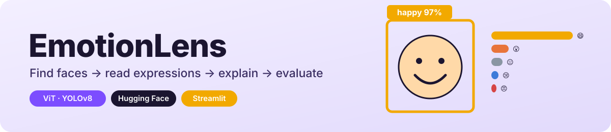
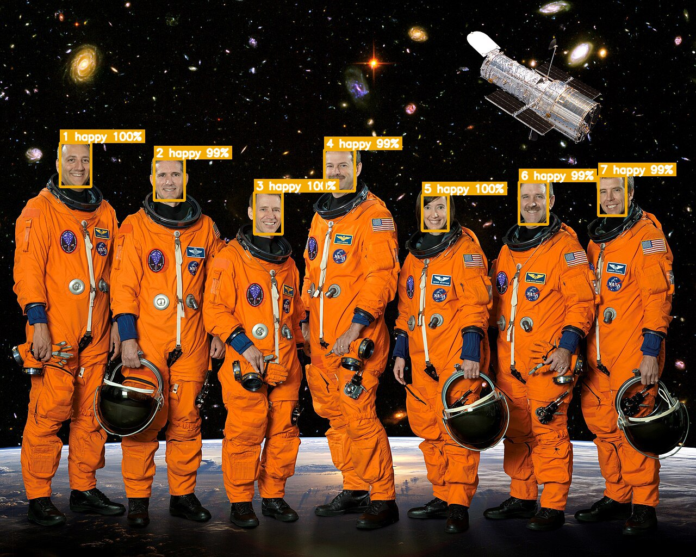
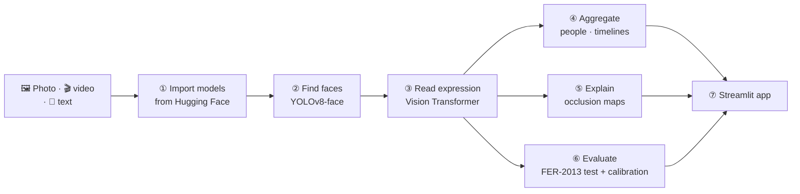
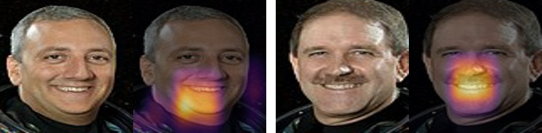
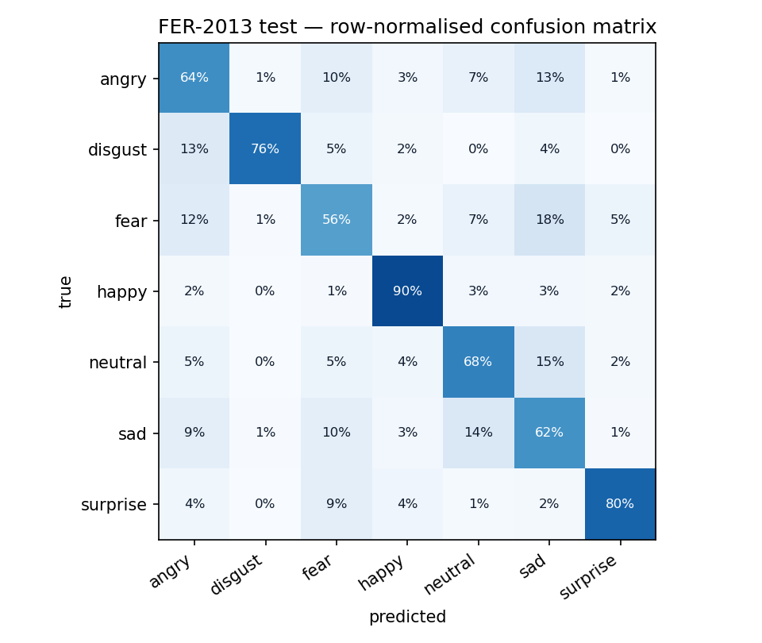
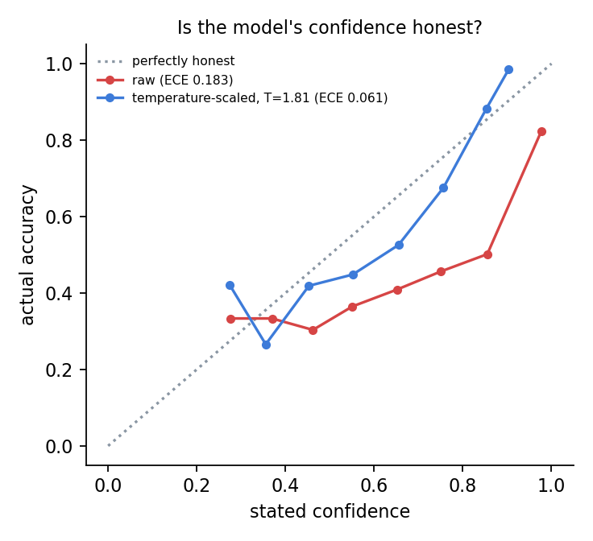

<p align="center"></p>

<p align="center">
  
  
  
  
  
</p>

**EmotionLens finds every face in a photo or video and reads its expression.** It covers 7 emotions:
angry, disgust, fear, happy, neutral, sad and surprise. It then shows *why* the model decided what it did,
compares the face with what the person *said*, and reports **how accurate and how honest** the model
really is on 3,589 held-out faces.

<p align="center">
  
  <br><sub>Seven faces found and read (NASA STS-125 crew portrait, public domain).</sub>
</p>

---

## 🧭 The walkthrough



| Step | What happens | Where |
|---|---|---|
| **① Import models** | Three pretrained models from the Hub: [`arnabdhar/YOLOv8-Face-Detection`](https://huggingface.co/arnabdhar/YOLOv8-Face-Detection), [`trpakov/vit-face-expression`](https://huggingface.co/trpakov/vit-face-expression) (a ViT fine-tuned on FER-2013), and [`j-hartmann/emotion-english-distilroberta-base`](https://huggingface.co/j-hartmann/emotion-english-distilroberta-base) for text. | [`emotionlens/models.py`](emotionlens/models.py) |
| **② Find faces** | YOLOv8 boxes every face. If it's unavailable, OpenCV's Haar cascade takes over. | [`emotionlens/analyze.py`](emotionlens/analyze.py) |
| **③ Read expression** | Crop each face with a margin, then the ViT returns 7 probabilities. | `analyze.classify_crops` |
| **④ Aggregate** | Photos → one card per face. Video → faces linked across frames by box overlap (IoU) give one emotion timeline per person, smoothed with a rolling mean. Text → the same 7 labels, so you can compare **face vs. words** (sarcasm detector 🙃). | `analyze.analyze_video` |
| **⑤ Explain** | **Occlusion sensitivity**: grey out a patch, re-ask the model, and measure how much the prediction's log-odds drop. Bright = it mattered. | [`emotionlens/explain.py`](emotionlens/explain.py) |
| **⑥ Evaluate** | Score the full FER-2013 **test** split, then fix over-confidence with **temperature scaling** fitted on the separate **validation** split. | [`emotionlens/evaluate.py`](emotionlens/evaluate.py) |

<p align="center">
  
  <br><sub>Why "happy"? Hiding the smile changes the answer most, so the model is looking at the right thing.</sub>
</p>

---

## 📊 How good is it? (3,589 faces the model never saw)

| Metric | Score |
|---|---|
| **Accuracy** | **71.8 %** (model card: 71.2 %) |
| **Macro-F1** | **0.711** |
| Always-guess-"happy" baseline | 24.5 % |
| Human agreement with FER-2013 labels (reference) | ~65 % |

| Emotion | Precision | Recall | F1 |
|---|---|---|---|
| 😄 happy | 0.91 | 0.90 | **0.91** |
| 😮 surprise | 0.83 | 0.80 | 0.82 |
| 🤢 disgust | 0.75 | 0.76 | 0.76 |
| 😐 neutral | 0.70 | 0.68 | 0.69 |
| 😠 angry | 0.62 | 0.64 | 0.63 |
| 😢 sad | 0.57 | 0.62 | 0.59 |
| 😨 fear | 0.61 | 0.56 | **0.59** |

<p align="center">
  
  
</p>

**The interesting finding: the model is over-confident.** 73 % of its predictions claim over 90 %
confidence, but those are right only 82 % of the time (expected calibration error **0.183**). One
learned number, a temperature *T* fitted on the validation split, softens the probabilities. The
result: **T = 1.81** cuts the calibration error from **0.183 to 0.061** (−67 %). Accuracy doesn't change, because the ranking is the same, but the
percentages you see in the app become honest.

Fear ↔ sad and angry ↔ disgust are the classic FER-2013 confusions. The faces are 48×48 greyscale, and
even people disagree on many of them.

---

## 🚀 Run it

```bash
git clone https://github.com/CohenTheCoder/emotion-lens.git && cd emotion-lens
python3 -m venv .venv && source .venv/bin/activate
pip install -r requirements.txt
streamlit run app.py
```

* **📸 Photo**: upload, take a selfie, or try held-out sample faces with their true labels. Then *Explain*
  the prediction, and type what the person said to compare face vs. words.
* **🎬 Video**: an emotion timeline per person, plus time-share stats and CSV export.
* **💬 Text**: one message per line, 7 emotions each.
* **📊 How accurate is it?**: the evaluation above, interactive.

```bash
python -m emotionlens.evaluate --n 600     # quick stratified run (~3 min on CPU)
python -m emotionlens.evaluate --n 0       # full test split + 1,200 validation faces for T
pytest                                     # unit + model smoke tests
```

## 📁 Project layout

```
emotion-lens/
├── app.py                      # Streamlit app
├── emotionlens/
│   ├── models.py               # ① Hugging Face models
│   ├── analyze.py              # ②③④ faces → expressions → people / timelines / text
│   ├── explain.py              # ⑤ occlusion sensitivity
│   └── evaluate.py             # ⑥ accuracy, F1, confusion, ECE, temperature scaling
├── docs/eval.json              # saved evaluation results (the app reads these)
├── scripts/make_readme_assets.py
└── tests/
```

## ⚠️ Responsible use
A facial expression is a signal, not a feeling. People smile politely and hide sadness, and expression norms
differ across cultures. FER-2013 also has known demographic imbalances. This project is for learning and
fun. Don't use expression recognition to make decisions about people (hiring, grading, policing).

## 🙏 Credits
Models: [trpakov/vit-face-expression](https://huggingface.co/trpakov/vit-face-expression) ·
[arnabdhar/YOLOv8-Face-Detection](https://huggingface.co/arnabdhar/YOLOv8-Face-Detection) (AGPL-3.0, downloaded at runtime) ·
[j-hartmann/emotion-english-distilroberta-base](https://huggingface.co/j-hartmann/emotion-english-distilroberta-base).
Data: FER-2013 via [`AutumnQiu/fer2013`](https://huggingface.co/datasets/AutumnQiu/fer2013), downloaded at
runtime and not redistributed. Photo: NASA (public domain).
